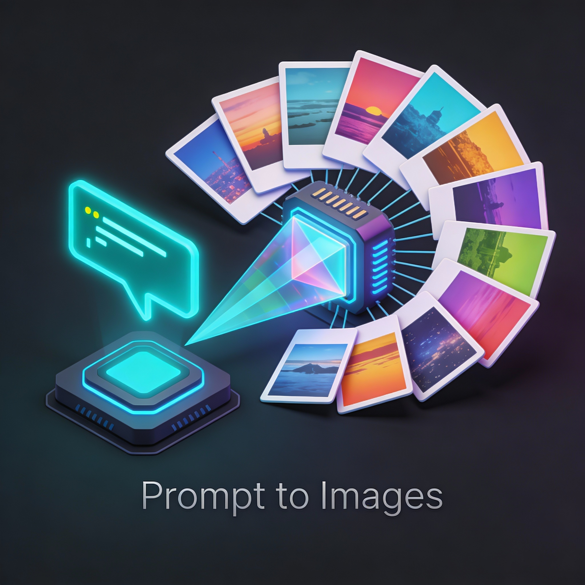
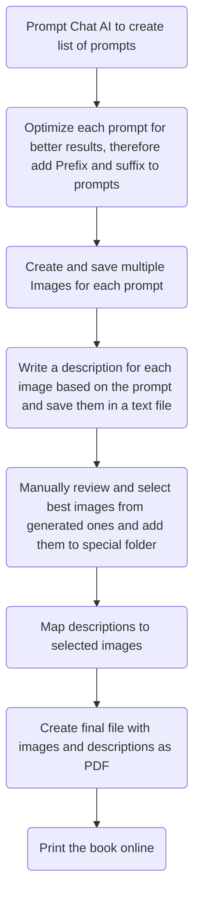

# README


<a id="readme-top"></a>

<!-- PROJECT SHIELDS -->

[![Forks][forks-shield]][forks-url]
[![Stargazers][stars-shield]][stars-url]
[![Issues][issues-shield]][issues-url]
[![Contributors][contributors-shield]][contributors-url]
[![Creative Commons Attribution-NonCommercial 4.0 International License][license-shield]][license-url]
[![LinkedIn][linkedin-shield]][linkedin-url]

<!-- PROJECT LOGO -->
<br />
<div align="center">
  <a href="https://github.com/d-solve-de/promptToImages">
    
  </a>

<h3 align="center">Prompt to Images</h3>

  <p align="center">
    This project automates the creation of a children's image book using generative AI models from Google Vertex AI. It generates images and descriptions based on prompts, compiles them into a PDF, and prepares it for printing.
<!--    <br />
    <a href="https://github.com/d-solve-de/promptToImages"><strong>Explore the docs »</strong></a>
    <br />
    <br />
    <a href="https://github.com/d-solve-de/promptToImages">View Demo</a>
    &middot;
    <a href="https://github.com/d-solve-de/promptToImages/issues/new?labels=bug&template=bug-report---.md">Report Bug</a>
    &middot;
    <a href="https://github.com/d-solve-de/promptToImages/issues/new?labels=enhancement&template=feature-request---.md">Request Feature</a>
-->
  </p>
</div>


<!-- TABLE OF CONTENTS -->
<details>
  <summary>Table of Contents</summary>
  <ol>
    <li>
      <a href="#about-the-project">About The Project</a>
      <ul>
        <li><a href="#built-with">Built With</a></li>
      </ul>
    </li>
    <li>
      <a href="#getting-started">Getting Started</a>
      <ul>
        <li><a href="#prerequisites">Prerequisites</a></li>
       <!-- <li><a href="#installation">Installation</a></li> -->
      </ul>
    </li>
    <li><a href="#usage">Usage</a></li>
    <li><a href="#roadmap">Roadmap</a></li>
    <li><a href="#contributing">Contributing</a></li>
    <li><a href="#license">License</a></li>
    <li><a href="#contact">Contact</a></li>
    <li><a href="#acknowledgments">Acknowledgments</a></li>
  </ol>
</details>


<!-- ABOUT THE PROJECT -->
## About The Project

This project automates the creation of a children's image book using generative AI models from Google Vertex AI. It generates images and descriptions based on prompts, compiles them into a PDF, and prepares it for printing.
<!-- [![Product Name Screen Shot][product-screenshot]](https://example.com) -->

<p align="right">(<a href="#readme-top">back to top</a>)</p>

### Built With

* [![Python][Python]][https://www.python.org/]
* [![GenAI][GenAI]][https://cloud.google.com/genai/docs]
* [![Flask][Flask]][https://flask.palletsprojects.com/]
* [![Keycloak][Keycloak]][https://www.keycloak.org/]


<p align="right">(<a href="#readme-top">back to top</a>)</p>

<!-- GETTING STARTED -->
## Getting Started

This is an example of how you may give instructions on setting up your project locally.
To get a local copy up and running follow these simple example steps.

### Prerequisites

This is an example of how to list things you need to use the software and how to install them.
* Python 3.x
  ```sh
  pip install -r requirements.txt
  ```

* Create a Vertex AI API Key and set it as environment variable
  ```sh
  export GEMINI_API_KEY="your_api_key_here"
  ```


<!--
### Installation

1. Get a free API Key at [https://example.com](https://example.com)
2. Clone the repo
   ```sh
   git clone https://github.com/d-solve-de/promptToImages.git
   ```
3. Install NPM packages
   ```sh
   npm install
   ```
4. Enter your API in `config.js`
   ```js
   const API_KEY = 'ENTER YOUR API';
   ```
5. Change git remote url to avoid accidental pushes to base project
   ```sh
   git remote set-url origin d-solve-de/promptToImages
   git remote -v # confirm the changes
   ```

<p align="right">(<a href="#readme-top">back to top</a>)</p>
-->


<!-- USAGE EXAMPLES -->
## Usage

<!-- Use this space to show useful examples of how a project can be used. Additional screenshots, code examples and demos work well in this space. You may also link to more resources.
-->

1. Store your Google Gemini API key in the environment variable `GEMINI_API_KEY`.

2. Run the script to generate images and descriptions
   ```sh
   python create-images.py
3. The generated images will be saved in the `generated_images` folder, and descriptions in `descriptions.txt`.
4. Review the generated images and select the best ones for your book.
5. Map the selected images to their descriptions and create a PDF book.

<!-- _For more examples, please refer to the [Documentation](https://example.com)_ -->

<p align="right">(<a href="#readme-top">back to top</a>)</p>

Program Flowchart:



<!-- ROADMAP -->
## Roadmap

- [ ] add status bar whereever it makes sense - use a library to show progress
- [ ] write prompts to file after each processing so progress is stored secure to save time and allow interruptions
- [ ] write own log files per user/ project to allow better debugging
- [ ] add the option to optimize multiple prompts at a time but allow the user to configure this parameter
- [ ] add the option to continue if one prompt/ image makes problems - delete image from descriptions and generation process
- [ ] add right logging for multi user use case
- [ ] Add a database to store prompts, images, descriptions, selections
- [ ] Add a nice Web UI with flask and scale the number of users
- [ ] Add ability for user to choose pictures and delete some
- [ ] Add ability to create different types of books (e.g. recipe books, travel guides, etc.)
- [ ] Use OpenRouter instead of Vertex AI
- [ ] Automatically list all available models
- [ ] Use Keycloak for Login
- [ ] Add cost transparency and Billing 

See the [open issues](https://github.com/d-solve-de/promptToImages/issues) for a full list of proposed features (and known issues).

<p align="right">(<a href="#readme-top">back to top</a>)</p>


<!-- CONTRIBUTING -->
## Contributing

Contributions are what make the open source community such an amazing place to learn, inspire, and create. Any contributions you make are **greatly appreciated**.

If you have a suggestion that would make this better, please fork the repo and create a pull request. You can also simply open an issue with the tag "enhancement".
Don't forget to give the project a star! Thanks again!

1. Fork the Project
2. Create your Feature Branch (`git checkout -b feature/AmazingFeature`)
3. Commit your Changes (`git commit -m 'Add some AmazingFeature'`)
4. Push to the Branch (`git push origin feature/AmazingFeature`)
5. Open a Pull Request

<p align="right">(<a href="#readme-top">back to top</a>)</p>

### Top contributors:

<a href="https://github.com/d-solve-de/promptToImages/graphs/contributors">
  
</a>


<!-- LICENSE -->
## License

Distributed under the Creative Commons Attribution-NonCommercial 4.0 International License. See `LICENSE.txt` for more information.

<p align="right">(<a href="#readme-top">back to top</a>)</p>


<!-- CONTACT -->
## Contact

Felix Paul- mail@felix-paul.de

Project Link: [https://github.com/d-solve-de/promptToImages](https://github.com/d-solve-de/promptToImages)

<p align="right">(<a href="#readme-top">back to top</a>)</p>


<!-- ACKNOWLEDGMENTS -->
## Acknowledgments

* []()


<p align="right">(<a href="#readme-top">back to top</a>)</p>


<!-- MARKDOWN LINKS & IMAGES -->
<!-- https://www.markdownguide.org/basic-syntax/#reference-style-links -->
[contributors-shield]: https://img.shields.io/github/contributors/d-solve-de/promptToImages.svg?style=for-the-badge
[contributors-url]: https://github.com/d-solve-de/promptToImages/graphs/contributors
[forks-shield]: https://img.shields.io/github/forks/d-solve-de/promptToImages.svg?style=for-the-badge
[forks-url]: https://github.com/d-solve-de/promptToImages/network/members
[stars-shield]: https://img.shields.io/github/stars/d-solve-de/promptToImages.svg?style=for-the-badge
[stars-url]: https://github.com/d-solve-de/promptToImages/stargazers
[issues-shield]: https://img.shields.io/github/issues/d-solve-de/promptToImages.svg?style=for-the-badge
[issues-url]: https://github.com/d-solve-de/promptToImages/issues
[license-shield]: https://img.shields.io/github/license/d-solve-de/promptToImages.svg?style=for-the-badge
[license-url]: https://github.com/d-solve-de/promptToImages/blob/master/LICENSE.txt
[linkedin-shield]: https://img.shields.io/badge/-LinkedIn-black.svg?style=for-the-badge&logo=linkedin&colorB=555
[linkedin-url]: https://linkedin.com/in/felix-paul-6134a9251
[product-screenshot]: images/screenshot.png
<!-- Shields.io badges. You can a comprehensive list with many more badges at: https://github.com/inttter/md-badges -->
[Next.js]: https://img.shields.io/badge/next.js-000000?style=for-the-badge&logo=nextdotjs&logoColor=white
[Next-url]: https://nextjs.org/
[React.js]: https://img.shields.io/badge/React-20232A?style=for-the-badge&logo=react&logoColor=61DAFB
[React-url]: https://reactjs.org/
[Vue.js]: https://img.shields.io/badge/Vue.js-35495E?style=for-the-badge&logo=vuedotjs&logoColor=4FC08D
[Vue-url]: https://vuejs.org/
[Angular.io]: https://img.shields.io/badge/Angular-DD0031?style=for-the-badge&logo=angular&logoColor=white
[Angular-url]: https://angular.io/
[Svelte.dev]: https://img.shields.io/badge/Svelte-4A4A55?style=for-the-badge&logo=svelte&logoColor=FF3E00
[Svelte-url]: https://svelte.dev/
[Laravel.com]: https://img.shields.io/badge/Laravel-FF2D20?style=for-the-badge&logo=laravel&logoColor=white
[Laravel-url]: https://laravel.com
[Bootstrap.com]: https://img.shields.io/badge/Bootstrap-563D7C?style=for-the-badge&logo=bootstrap&logoColor=white
[Bootstrap-url]: https://getbootstrap.com
[JQuery.com]: https://img.shields.io/badge/jQuery-0769AD?style=for-the-badge&logo=jquery&logoColor=white
[JQuery-url]: https://jquery.com 